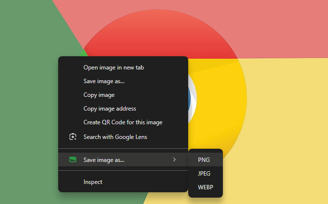

# Smart Image Saver

**Smart Image Saver** is a lightweight Chrome extension that allows users to save images from any webpage in different formats (PNG, JPEG, WEBP). With just a right-click, you can quickly choose the format in which you want to save the image, enhancing your browsing and content collection experience.

## Key Features

- **Save Images Easily**: Right-click on any image and select "Save image as..." to choose from PNG, JPEG, or WEBP formats.
- **Multiple Format Support**: Seamlessly save images in the format of your choice (PNG, JPEG, WEBP).
- **Fast and Efficient**: Streamlined interface ensures quick saving without complicated steps.

## Getting Started

### Installation

#### Install from Chrome Web Store

You can install the extension directly from the [Chrome Web Store](https://chromewebstore.google.com/detail/smart-image-saver/pnjbhbeppkgcblpgbcddnlcjhbhjhdao).

#### Manual Installation Using CRX File

1. Download the latest release CRX file from the [Project page](https://github.com/firatkaanbitmez/smart-image-saver-chrome-extension/releases).
2. Open Chrome and navigate to `chrome://extensions/`.
3. Enable "Developer mode" by toggling the switch in the top right corner.
4. Drag and drop the downloaded `.crx` file into the `chrome://extensions/` page to install the extension.

#### Install Using Source Code

1. Download the latest release from the [Project page](https://github.com/firatkaanbitmez/smart-image-saver-chrome-extension).
2. Extract the downloaded ZIP file.
3. Open Chrome and navigate to `chrome://extensions/`.
4. Enable "Developer mode" by toggling the switch in the top right corner.
5. Click on "Load unpacked" and select the `Source` folder from the extracted files.

## How to Use

- **Activate Context Menu**: Right-click on any image on a webpage.
- **Select Format**: Hover over the "Save image as..." menu option and select the desired format (PNG, JPEG, or WEBP).
- **Download Image**: The image will be saved to your default downloads folder in the selected format.

## Screenshots

## Error Solutions for Chrome and Edge

If you encounter the following error during installation:

**EN**: "This extension is not from any known source, and may have been added without your knowledge."

**TR**: "Bu uzantı, bilinen herhangi bir kaynaktan değil ve bilginiz dışında eklenmiş olabilir."

Follow these steps to resolve the issue:

1. Run the `fix.bat` file located in the project folder as an administrator. This will adjust the necessary Windows Registry settings to support the installation of the extension.
2. The browsers will be restarted automatically upon completion.

## Development

To build and test the extension locally:

1. Navigate to the `Source` folder in your terminal.
2. Use the `fix.bat` script to register the extension and restart browsers.

## Configurable Options

You can customize your experience by editing the source code for options like:
- **Default Image Format**: Set your preferred default format (PNG, JPEG, WEBP).
- **Filename Structure**: Customize how filenames are generated.

## Contributing

We welcome contributions! If you have ideas or improvements, feel free to fork the project, implement your changes, and submit a pull request.

## Development Tools

Built with:
- **HTML/CSS** for the context menu interface.
- **JavaScript** for logic and interaction handling.
- Chrome's **downloads**, **contextMenus**, and **activeTab** APIs for image saving and management.

## Feedback and Support

Got feedback or need help? Reach out via [email](mailto:firatbitmez.dev@gmail.com).

## License

**Smart Image Saver** is made available under the MIT License. See the [LICENSE.md](LICENSE.md) file for full details.
